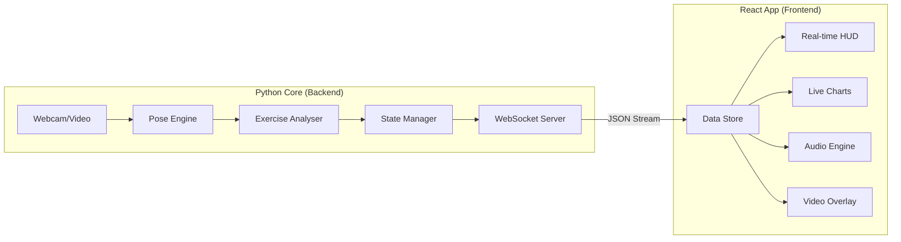

# Frontend Workflow & Data Schema

This document outlines the data flow between the Python processing core and the React/Vite frontend. It serves as a specification for designing the frontend UI and implementing the communication layer.

## 1. High-Level Architecture

Maitri follows a **Client-Server** architecture where the heavy lifting (MediaPipe processing and Rule Engine evaluation) happens on the Python server, and the visualization/interaction happens in the React SPA.



## 2. Communication Layer

- **Protocol**: WebSockets (Recommended for real-time skeletal data at 30fps).
- **Endpoint**: `ws://localhost:8000/ws`
- **Format**: JSON

---

## 3. Data Schema (Per Frame)

Every frame processed by the backend should emit a message following this structure.

### Global Frame Object
```json
{
  "timestamp": 1715690000.123,
  "exercise": "Squats",
  "source": "Webcam",
  "status": "active",
  "dimensions": { "width": 640, "height": 480 }
}
```

### Analysis Result (The Core Data)
Based on `BaseResult` and specific exercise results (like `SquatResult`):

```json
{
  "result": {
    "rep_count": 12,
    "rep_just_completed": false,
    "has_issue": true,
    "feedback": "Push knees out!",
    "metrics": {
      "phase": "descending",
      "knee_cave": true,
      "forward_lean": false,
      "depth_reached": false,
      "left_knee_angle": 105.4,
      "right_knee_angle": 104.8,
      "torso_angle": 12.5,
      "hip_to_knee_ratio": 0.65
    }
  }
}
```

### Pose Data (Landmarks)
For the frontend to draw the skeleton overlay locally:

```json
{
  "landmarks": {
    "left_shoulder": {"x": 0.45, "y": 0.32, "z": -0.1},
    "right_shoulder": {"x": 0.55, "y": 0.32, "z": -0.12},
    "left_hip": {"x": 0.46, "y": 0.65, "z": 0.05},
    "right_hip": {"x": 0.54, "y": 0.65, "z": 0.04}
    // ... all 33 MediaPipe landmarks if needed
  }
}
```

### Audio/Event Notifications
Triggered when `get_audio_cue()` returns a value:

```json
{
  "event": {
    "type": "audio_cue",
    "text": "Knees caving in, push them out",
    "is_urgent": true
  }
}
```

---

## 4. UI Component Mapping

| Backend Field | UI Representation | Design Target |
| :--- | :--- | :--- |
| `rep_count` | Large Counter | High-contrast Zinc/Slate typography |
| `has_issue` | Border/Glow | Pulsing Red/Green ambient lighting |
| `feedback` | Status Bar | Bottom-centered glassmorphic pill |
| `metrics` | Real-time Graphs | Recharts Sparklines (Angles over time) |
| `phase` | Progress Stepper | Visual indicator of Standing -> Descending |
| `landmarks` | Canvas Overlay | Clean, minimalist SVG lines (not raw MP) |

## 5. Design Decisions for Frontend

1.  **Video Rendering**: The frontend should capture the local webcam stream via `getUserMedia` and overlay the skeletal lines. This minimizes latency. The Python backend receives the frames, processes them, and sends *only* the data back.
2.  **State Synchronization**: The backend is the "Source of Truth" for rep counting and phase detection to prevent desync between what the user hears (audio) and sees (UI).
3.  **Responsive HUD**: Metrics like `knee_angle` should be visualized with gauges or horizontal bars to allow users to see "how close" they are to the depth threshold.

## 6. Initialization Workflow

1.  **Handshake**: Frontend connects to `http://localhost:8000/registry` to get available exercises.
2.  **Configuration**: User selects "Squats" and clicks "Start".
3.  **Stream**: Frontend opens WebSocket and starts sending/receiving frame data.
4.  **Calibration**: (Optional) Backend detects if the full body is in frame before starting the session.
